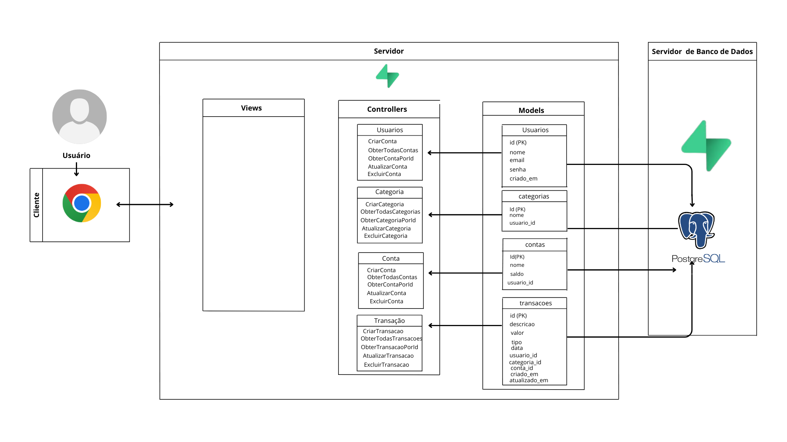

 <p align="center">

<a href= "https://www.inteli.edu.br/"></a>

</p>


# Prosperis


## Inteli - Instituto de Tecnologia e Liderança


##  Autor:

- <a href="https://www.linkedin.com/in/paulo-henrique0601/">Paulo Henrique Bueno Fernandes </a>


##  Professores:


### Orientador(a)

- <a href="https://www.linkedin.com/in/fabiana-martins-de-oliveira-8993b0b2/">Fabiana Martins De Oliveira </a>

### Instrutores

- <a href="https://www.linkedin.com/in/bryan-kano/">Brayan Kano </a>

- <a href="https://www.linkedin.com/in/gui-cestari/">Guilherme Cestari</a>


## Descrição

&emsp; A **Prosperis** é uma plataforma intuitiva e inovadora de controle financeiro, projetada para transformar a forma como indivíduos, famílias e pequenos empreendedores gerenciam suas finanças. Com uma interface amigável e funcionalidades avançadas, a Prosperis permite que você organize suas finanças com precisão, acompanhe transações, visualize saldos atualizados e obtenha uma visão clara de sua saúde financeira. Nosso objetivo é empoderar os usuários a alcançarem liberdade financeira por meio de uma ferramenta prática que simplifica a contabilidade, elimina a complexidade de planilhas manuais e promove decisões informadas. Seja para controlar gastos diários, planejar economias, gerenciar o orçamento familiar ou monitorar o fluxo de caixa de um negócio, a Prosperis é a solução ideal.


Com a Prosperis, você pode registrar receitas e despesas de forma fácil, categorizando-as em áreas como alimentação, moradia, lazer ou outras personalizadas, garantindo uma organização que se adapta às suas necessidades. O sistema inteligente atualiza automaticamente seu saldo após cada transação, oferecendo cálculos precisos e eliminando erros manuais. Além disso, a plataforma gera relatórios detalhados e visuais que revelam padrões de gastos, identificam categorias de maior impacto e destacam tendências financeiras ao longo do tempo, ajudando você a entender melhor seus hábitos. Para quem busca planejamento, a Prosperis permite definir metas financeiras e limites de gastos por categoria, enviando alertas quando você está próximo de excedê-los, o que facilita o controle do orçamento.

## Sumário

* [Arquitetura MVC](#arquitetura-mvc)
* [Estrutura de Pastas](#estrutura-de-pastas)
* [Arquivos Importantes](#arquivos-importantes)
* [Pré-requisitos](#pré-requisitos)
* [Configuração do Banco de Dados](#configuração-do-banco-de-dados)
* [Instalação e Execução](#instalação-e-execução)
* [Rodando as Migrações](#rodando-as-migrações)
* [Como Rodar o Servidor](#como-rodar-o-servidor)
* [Testando a API (Endpoints)](#testando-a-api-endpoints)
* [Licença](#licença)

---

## Arquitetura MVC

A aplicação segue o padrão de arquitetura **Model-View-Controller (MVC)** para separar as responsabilidades e organizar o código.

* **Model (Modelo):** Representa a estrutura dos dados da aplicação e interage diretamente com o banco de dados. Neste projeto, a modelagem dos dados é feita por meio de comandos SQL.
    * **Modelos Presentes:** `Usuários`, `Categorias`, `Contas`, `Transações`.
* **View (Visão):** Responsável pela interface com o usuário. Para esta API, a "View" seria um frontend (web ou mobile) separado que consumiria os endpoints fornecidos.
* **Controller (Controlador):** Gerencia a lógica de negócios, recebe requisições HTTP, valida dados, interage com o Modelo (banco de dados) e envia respostas ao cliente.

Ex:  ---

## Estrutura de Pastas

Dentre os arquivos e pastas presentes na raiz do projeto, definem-se:

* **`config`**: Configurações do banco de dados e outras configurações do projeto.
* **`controllers`**: Controladores da aplicação (lógica de negócio).
* **`models`**: Modelos da aplicação (definições de dados e interações com o banco de dados).
* **`routes`**: Rotas da aplicação.
* **`services`**: Serviços auxiliares que centralizam regras de negócio reutilizáveis.
* **`assets`**: Arquivos públicos como imagens, fontes e outros recursos estáticos.
* **`scripts`**: Scripts JavaScript públicos utilizados no lado do cliente.
* **`styles`**: Arquivos CSS utilizados para estilização da interface da aplicação.
* **`tests`**: Testes automatizados.
* **`views`**: Views da aplicação (se aplicável).

## Arquivos Importantes

* **`.gitignore`**: Arquivo que especifica quais arquivos/pastas devem ser ignorados pelo Git.
* **`.env.example`**: Exemplo de arquivo para definir variáveis de ambiente do projeto. (Mudei para .env.example para segurança)
* **`jest.config.js`**: Arquivo de configuração do Jest, utilizado para testes automatizados.
* **`package.json`**: Arquivo que gerencia as dependências e scripts do projeto Node.js.
* **`package-lock.json`**: Arquivo que registra as versões exatas das dependências instaladas.
* **`server.js`**: Arquivo principal que inicializa e configura o servidor da aplicação.
* **`rest.http`**: Arquivo opcional utilizado para testar endpoints da API diretamente (se você usar o VS Code com a extensão Rest Client, por exemplo).
* **`README.md`**: Arquivo que serve como guia introdutório e explicação geral sobre o projeto e a aplicação (o mesmo arquivo que você está lendo agora).

---

## Pré-requisitos

Antes de configurar e executar o código, certifique-se de ter instalado os seguintes programas e ferramentas:

* **Node.js**: [Download da versão 16.15.1 LTS](https://nodejs.org/pt-br/download/) (ou versão LTS mais recente recomendada).
* **npm**: Gerenciador de pacotes do Node.js (geralmente vem junto com o Node.js).
* **PostgreSQL**: Servidor de banco de dados relacional. [Guia de Instalação](https://www.postgresql.org/download/)
* **Postman** (ou Insomnia, Thunder Client para VS Code): Ferramenta para testar os endpoints da API.

---

## Configuração do Banco de Dados

1.  **Crie um banco de dados PostgreSQL** para o projeto. Você pode usar o `psql` (terminal) ou uma ferramenta gráfica como `pgAdmin`.
    ```sql
    CREATE DATABASE nome_do_seu_banco;
    ```
    *(Substitua `nome_do_seu_banco` pelo nome que você deseja para o seu banco de dados.)*

2.  **Crie um arquivo `.env`** na raiz da pasta `src/backend` (ou na raiz do projeto se for o caso) com as seguintes variáveis de ambiente. Você pode usar o `.env.example` como base.

    ```dotenv
    DB_HOST=localhost
    DB_PORT=5432
    DB_USER=seu_usuario_postgres
    DB_PASSWORD=sua_senha_postgres
    DB_NAME=nome_do_seu_banco
    PORT=3000
    JWT_SECRET=sua_chave_secreta_para_geracao_de_tokens
    ```
    * Substitua `seu_usuario_postgres` e `sua_senha_postgres` pelas credenciais do seu usuário PostgreSQL.
    * Substitua `nome_do_seu_banco` pelo nome do banco de dados que você criou.
    * `PORT` é a porta que o servidor Node.js irá escutar.
    * `JWT_SECRET` é uma chave secreta para assinar e verificar tokens JWT (usado na autenticação). **ATENÇÃO:** Use uma string longa e aleatória e mantenha-a em segredo.

---

## Instalação e Execução

1.  Clone o repositório:
    ```bash
    git clone [https://github.com/seu-usuario/seu-repositorio.git](https://github.com/seu-usuario/seu-repositorio.git)
    cd seu-repositorio
    ```
2.  Navegue até a pasta do backend onde se encontra o `package.json`:
    ```bash
    cd src/backend # Ajuste este caminho se o seu backend estiver em outro lugar
    ```
3.  Instale todas as dependências do projeto:
    ```bash
    npm install
    ```
    Isso instalará todas as dependências definidas no arquivo `package.json` que são necessárias para rodar o projeto.

---

## Rodando as Migrações

Após instalar as dependências e configurar o arquivo `.env`, você precisa criar a estrutura do banco de dados (tabelas).

1.  Certifique-se de que o arquivo `migrations/init.sql` (ou equivalente) contém as instruções SQL para criar as tabelas `usuarios`, `categorias`, `contas` e `transacoes`.
2.  Execute o comando para rodar as migrações e criar o schema do banco de dados:
    ```bash
    npm run init-db
    ```
    Este comando executará o script de inicialização do banco de dados, criando todas as tabelas necessárias.

---

## Como Rodar o Servidor

Após as migrações, o projeto já está pronto para ser iniciado.

1.  Na pasta `src/backend` (ou a pasta raiz do seu backend), digite o comando abaixo no terminal:
    ```bash
    npm start
    ```
    Você deverá ver uma mensagem no console indicando que o servidor está rodando (ex: `Servidor rodando na porta 3000`).
2.  Agora você pode acessar a aplicação (se houver um frontend servido) através do link `http://localhost:3000/`. Para a API, ela estará disponível para requisições.

---

## Testando a API (Endpoints)

Com o servidor online, você pode testar os endpoints da API utilizando ferramentas como Postman, Insomnia ou a extensão "Thunder Client" do VS Code. A URL base para todas as rotas da API é `http://localhost:3001/api`.

**Observação sobre Autenticação:** A maioria dos endpoints (exceto registro/login de usuário) exige que você forneça um **JWT (JSON Web Token)** no cabeçalho `Authorization` como `Bearer SEU_TOKEN_JWT`. Este token é obtido após o login bem-sucedido de um usuário.

### Exemplo de Fluxo de Teste:

1.  **Registrar/Logar um Usuário:**
    * **Endpoint:** `POST /api/usuarios/registrar` (ou `/api/usuarios/login` se já registrado)
    * **Body (JSON):** `{ "nome": "Test User", "email": "test@example.com", "senha": "password123" }`
    * **Resultado:** Você receberá um `201 Created` (registro) ou `200 OK` (login) com um token JWT na resposta. Copie este token.

2.  **Testar Endpoints de Contas:**

    * **Criar Conta:**
        * **Método:** `POST`
        * **URL:** `http://localhost:3000/api/contas`
        * **Headers:** `Content-Type: application/json`, `Authorization: Bearer <seu_token_jwt>`
        * **Body (JSON):** `{"nome": "Minha Conta Corrente", "saldo": 1500.50}`
    * **Listar Contas:**
        * **Método:** `GET`
        * **URL:** `http://localhost:3000/api/contas`
        * **Headers:** `Authorization: Bearer <seu_token_jwt>`
    * **Obter Conta por ID:**
        * **Método:** `GET`
        * **URL:** `http://localhost:3000/api/contas/1` (use um ID válido retornado de uma criação)
        * **Headers:** `Authorization: Bearer <seu_token_jwt>`
    * **Atualizar Conta:**
        * **Método:** `PUT`
        * **URL:** `http://localhost:3000/api/contas/1` (use um ID válido)
        * **Headers:** `Content-Type: application/json`, `Authorization: Bearer <seu_token_jwt>`
        * **Body (JSON):** `{"nome": "Conta Corrente Principal", "saldo": 2000.00}`
    * **Excluir Conta:**
        * **Método:** `DELETE`
        * **URL:** `http://localhost:3000/api/contas/1` (use um ID válido)
        * **Headers:** `Authorization: Bearer <seu_token_jwt>`

*(Repita o processo para os endpoints de **Categorias** e **Transações**, ajustando a URL e o Body conforme necessário.)*

---

## Licença

(Escolha e adicione a licença do seu projeto, ex: [MIT License](https://opensource.org/licenses/MIT))

---